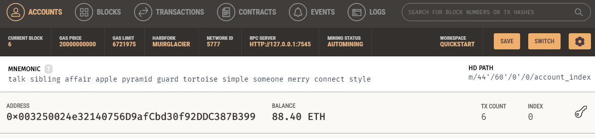
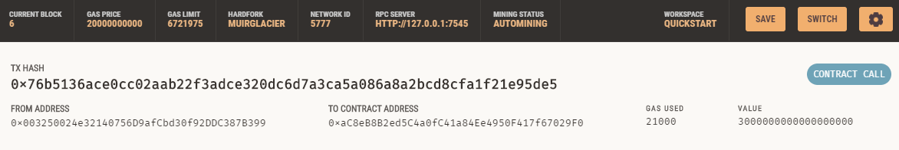

# Challenge 19 Fintech Finder

## Intro
Create an application that allows the user to select a Fintech professional and pay them for a set number of hours at their rate of pay.

## Technology
- Python
- Streamlit
- Web3
- bip44
- Ganache

## Results
Streamlit user interface:

Ganache accont balance:

Ganache transaction:

